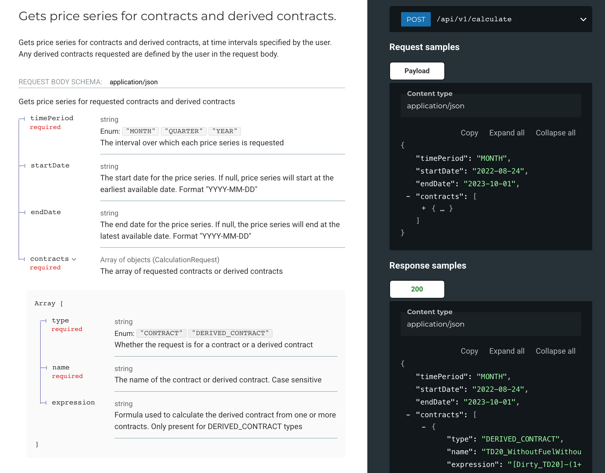
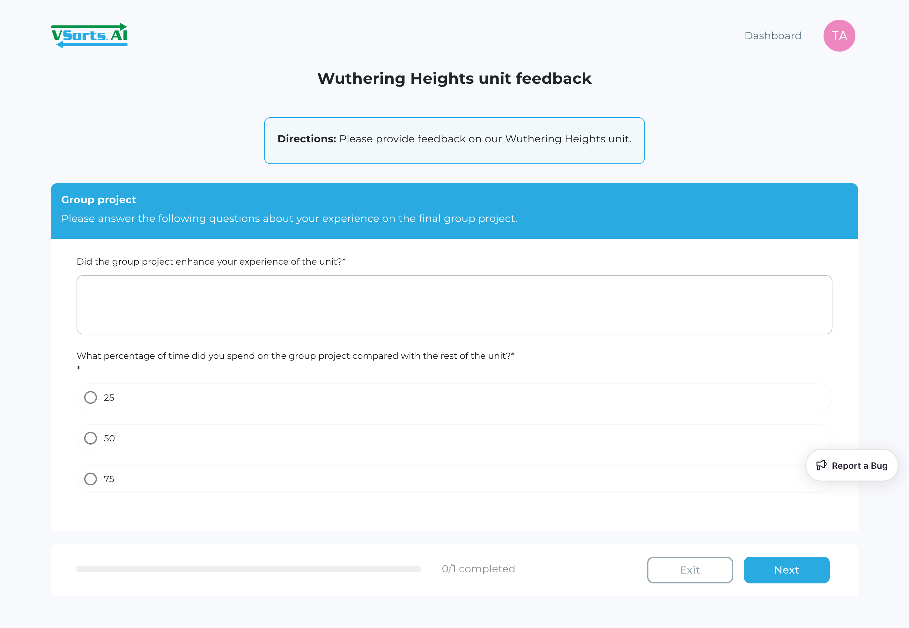

Hi, I'm Tammy. Thanks for visiting my portfolio page. Below are examples of technical documents I've created for different software projects.

## API Documentation
Designed API specifications for an early-stage fintech startup.

My contributions include:
- Translated founder's vision into tangible design doc

## Tutorial
Created tutorial on making API requests for both non-technical and technical users of Semantic Scholar's API product, complete with examples in Python and via Postman.

## User Guide
For a client's educational SaaS platform, I wrote user guides targeted at admin users and general users.

My contributions include:
- Introductions to the SaaS platform's features and step-by-step procedures for navigating its complex workflows
- Custom-made GIFs that demonstrate the look and feel of the platform
- Video guides that provide high-level overviews of each feature and its capabilities
- Comprehensive release notes that track changes to the Saas platfform

